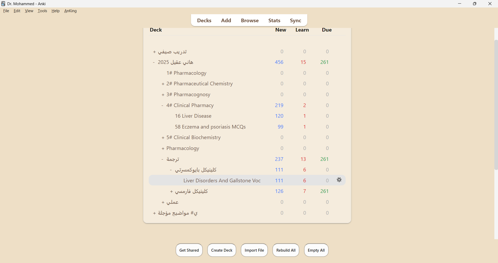
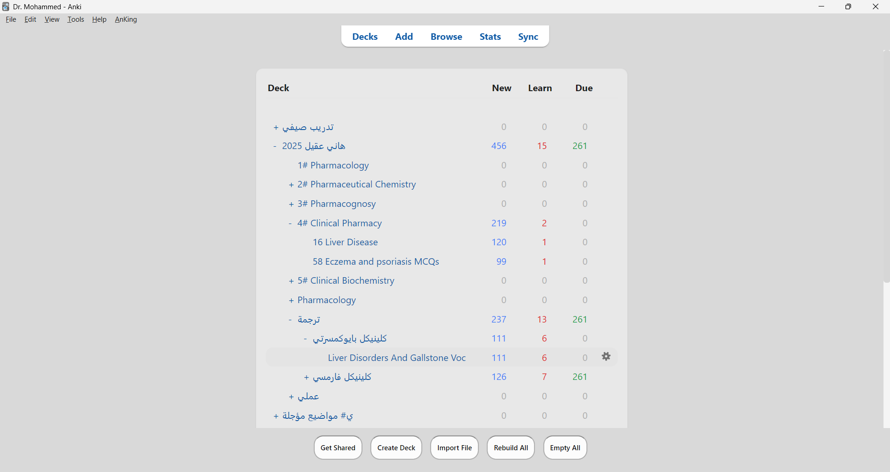

# AnkiThemeTwin

✨ **AnkiThemeTwin** brings **eye-comfort themes with advanced customization** to Anki — featuring **13+ built-in themes**, **custom theme creator**, **accessibility options**, and **intelligent theme scheduling**.

---

## 🎨 Features

### Themes
- **7 Eye-Comfort Light Themes**:
  - Sepia (Word-like)
  - Sepia (Paper)
  - Sepia (Special • Dr. Mohammed)
  - Gray (Word-like)
  - Gray (Paper)
  - Blue Light (Evening)
  - Olive Green (Natural)

- **6 Accessibility Themes**:
  - High Contrast Light - Maximum contrast for visual impairments
  - High Contrast Dark - Dark mode with high contrast
  - Dyslexia Friendly - Optimized for dyslexic readers
  - Deuteranopia Support - Color blindness optimized (red-green)
  - Protanopia Support - Color blindness optimized (red-green variant)
  - Tritanopia Support - Color blindness optimized (blue-yellow)

- **Unlimited Custom Themes**: Create your own themes with the visual color picker

### Customization Features
- **Custom Theme Creator** — Visual color picker for all theme elements
- **Theme Presets** — Save and load favorite theme + font combinations
- **Theme Preview Gallery** — See all themes before applying
- **Import/Export Themes** — Share themes as JSON files
- **Advanced Font Settings**:
  - Font family selection
  - Font size: 8-32px with slider or 7 presets (12, 14, 16, 18, 20, 22, 24px)
  - Line height adjustment (100-300%)
  - Letter spacing control (-5px to +10px)

### Intelligent Features
- **Scheduled Theme Switching** — Auto-switch themes based on time of day (morning, afternoon, evening, night)
- **Per-Deck Themes** — Set different themes for different decks
- **Study Session Modes** — Optimize display for Focus, Speed, or Detail modes
- **Keyboard Shortcuts** with enhanced visual feedback:
  - `Ctrl+Shift+1-7`: Quick theme switching
  - `Ctrl+Shift+=`: Increase font size
  - `Ctrl+Shift+-`: Decrease font size
- **Animation Settings** — Configurable theme transition effects
- **Quick Settings Panel** — Combined controls for theme, font, and study mode
- **Configuration Backup & Restore** — Export/import settings with versioning
- **Usage Statistics** — Track your theme usage patterns

### Visual Enhancements
- **Smooth Animations** — CSS transitions on all interactive elements
- **Enhanced Depth** — Card shadows and layered effects
- **Button Effects** — Press animations and elevation changes
- **Advanced Focus Indicators** — Multi-layer shadows and glow effects
- **Gradient Overlays** — Modern gradients on buttons, scrollbars, and headers
- **Background Patterns** — 5 optional patterns (None, Subtle, Dots, Grid, Lines)
- **Improved Typography** — Heading accents and better text hierarchy
- **Modal Animations** — Fade-in effects and entrance transitions

### Comprehensive Styling
- **All Anki Pages**: Card reviewer, editor fields, deck browser, card browser
- **Buttons & Menus**: Enhanced with hover states and focus indicators
- **Tables & Lists**: Styled headers and alternating row colors
- **Input Fields**: Custom focus indicators and borders
- **Scrollbars**: Gradient design with hover effects
- **Context-Aware CSS**: Optimized styling for each Anki page type

### Quality of Life
- **Instant Updates** — Changes apply immediately to all open views
- **WCAG AA Compliant** — All themes pass accessibility contrast guidelines
- **Easy Switching** — Access via **Tools → Theme: AnkiThemeTwin**
- **About Dialog** — Project details and GitHub link

---

## 📸 Screenshots
| Sepia Special | Gray Paper | Blue Light |
|---------------|------------|------------|
|  |  |  |

*(Screenshots live in `/images` in this repo.)*

---

## 📥 Installation

### Option A — from AnkiWeb (recommended)
- **AnkiWeb page:** https://ankiweb.net/shared/info/1256951397  
- **Add-on ID:** `1256951397`  
  Open Anki → **Tools → Add-ons → Get Add-ons…** → paste the ID → Install.

### Option B — manual file
1. Download the latest `.ankiaddon` from **[Releases](../../releases)**.  
2. In Anki: **Tools → Add-ons → Install from File…** and choose the file.  
3. Restart Anki.

---

## ⚙️ Requirements
- **Anki 2.1.55+** (Qt6/PyQt6). Older Qt5 builds are not supported.

---

## 🚀 Quick Start Guide

### Basic Usage
1. Install the add-on
2. Open **Tools → Theme: AnkiThemeTwin**
3. Select a theme from the menu
4. Use keyboard shortcuts for quick switching:
   - `Ctrl+Shift+1` through `Ctrl+Shift+7` for main themes
   - `Ctrl+Shift+=` to increase font size
   - `Ctrl+Shift+-` to decrease font size

### Advanced Features

#### Custom Theme Creator
1. Go to **Tools → Theme: AnkiThemeTwin → Create Custom Theme...**
2. Pick colors for each element using the color pickers
3. Save your theme with a custom name
4. Your theme will appear in the main menu

#### Theme Presets
1. Configure your perfect theme + font size combination
2. Go to **Manage Presets...**
3. Save current settings as a preset
4. Quick-load presets anytime

#### Scheduled Theme Switching
1. Open **Scheduled Theme Switching...**
2. Enable the feature
3. Set times and themes for morning, afternoon, evening, and night
4. Themes will auto-switch based on the time

#### Per-Deck Themes
1. Open **Per-Deck Themes...**
2. Enter deck name and select theme
3. Theme will auto-apply when reviewing that deck

#### Theme Preview
1. Open **Theme Preview Gallery...**
2. Browse all themes with visual previews
3. Click "Apply This Theme" to instantly switch

---

## ♿ Accessibility Features

### For Visual Impairments
- **High Contrast Light/Dark**: Maximum contrast ratios (WCAG AAA compliant)
- **Adjustable Font Sizes**: 8-32px range with preset options
- **Custom Letter Spacing**: Improve readability with adjustable spacing

### For Dyslexia
- **Dyslexia Friendly Theme**: Yellow background proven to reduce reading difficulty
- **Increased Line Height**: Adjustable up to 300%
- **Custom Font Support**: Use OpenDyslexic or other specialized fonts

### For Color Blindness
- **Deuteranopia Support**: Optimized for red-green color blindness
- **Protanopia Support**: Alternative red-green optimization
- **Tritanopia Support**: Optimized for blue-yellow color blindness

All accessibility themes maintain high contrast and readability while accommodating specific visual needs.

---

## 🎯 Theme Recommendations

### By Environment
- **Bright sunlight / Outdoor**: Gray (Paper) or Sepia (Paper) — darker backgrounds reduce glare
- **Office / Indoor lighting**: Sepia (Word-like), Gray (Word-like), or Sepia (Special)
- **Evening / Low light**: Blue Light (reduces eye strain)
- **Extended study sessions**: Sepia (Special), Olive Green — warm, natural tones reduce fatigue

### By Device
- **LCD screens**: Any theme works well
- **High-brightness displays**: Sepia or Gray themes to reduce eye strain
- **E-ink displays**: Gray (Word-like) or Gray (Paper) for best readability

### By Preference
- **Warm tones**: Sepia (Word/Paper/Special), Olive Green
- **Cool tones**: Gray (Word/Paper), Blue Light
- **Maximum contrast**: Gray (Paper)
- **Soft on eyes**: Sepia (Special), Blue Light

### Font Size Recommendations
- **14px**: For larger screens (24"+) or users who prefer more content per page
- **16px**: Default, optimal for most users and screen sizes
- **18px**: Better for extended reading sessions or smaller text in cards
- **20px**: For accessibility, visual impairment, or users who prefer larger text

---

## 🧰 Troubleshooting
- Colors didn’t change? Restart Anki, and ensure no other theming add-on overrides styles.
- You can switch any time from **Tools → Theme: AnkiThemeTwin**.
- Problems or feature requests? Open an issue on GitHub (link below).

---

## 🔗 Links
- **AnkiWeb:** https://ankiweb.net/shared/info/1256951397  
- **GitHub Repository:** https://github.com/MohammedTsmu/AnkiThemeTwin  
- **Issues (support):** https://github.com/MohammedTsmu/AnkiThemeTwin/issues

---

## 📝 Author
Developed with 💻 + ☕ by **Dr. Mohammed**.  
Feedback, issues, and contributions are welcome on GitHub.

---

## 📚 References
- Anki add-on hooks (CSS injection via `webview_will_set_content`)  
  https://addon-docs.ankiweb.net/hooks-and-filters.html
- Packaging & sharing add-ons (`.ankiaddon` zip format)  
  https://addon-docs.ankiweb.net/sharing.html
- Installing add-ons from Anki (Get Add-ons / Install from file)  
  https://docs.ankiweb.net/addons.html
- Qt Style Sheets (QSS) for widget theming  
  https://doc.qt.io/qt-6/stylesheet.html
- WCAG 2.1 contrast guidance (readability)  
  https://www.w3.org/WAI/WCAG21/Understanding/contrast-minimum.html
- Word Immersive Reader (background/page color)  
  https://support.microsoft.com/en-us/office/use-immersive-reader-in-word-a857949f-c91e-4c97-977c-a4efcaf9b3c1
